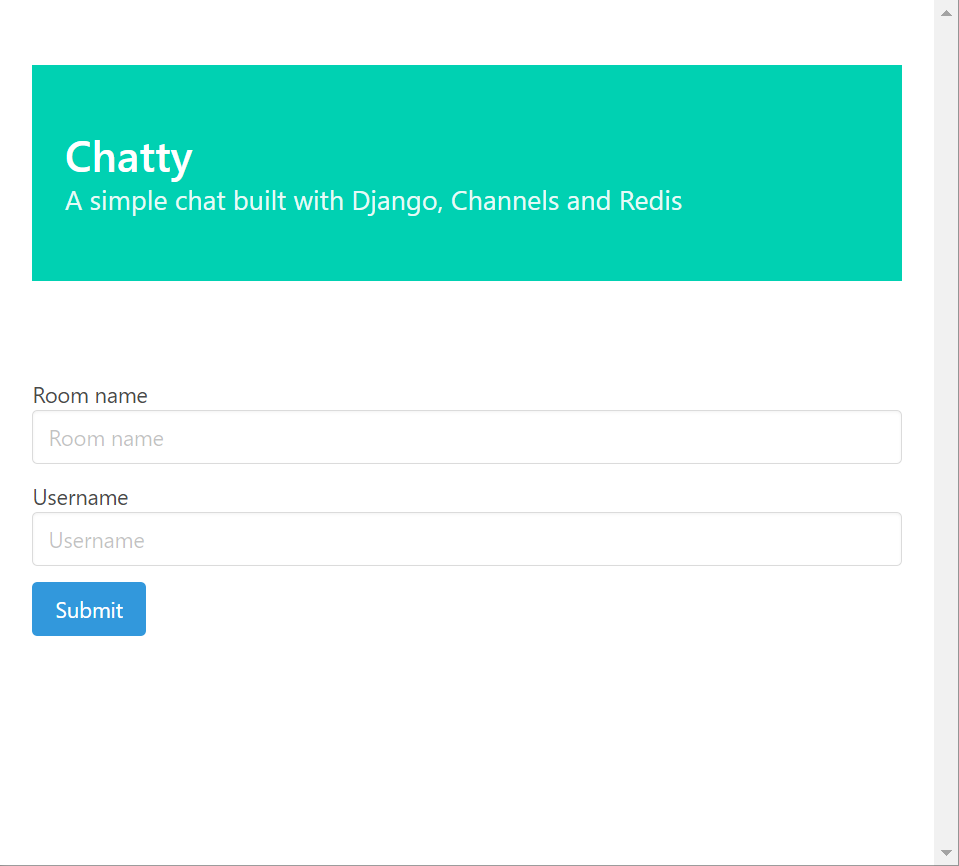
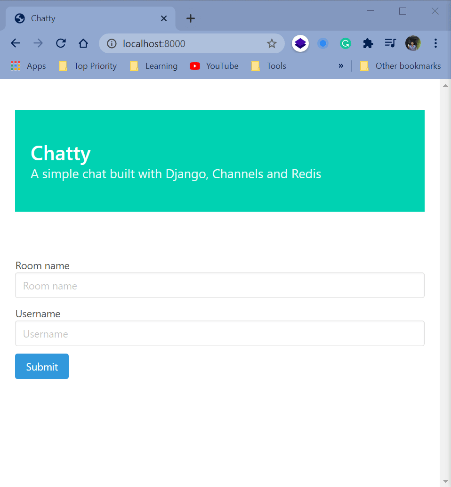
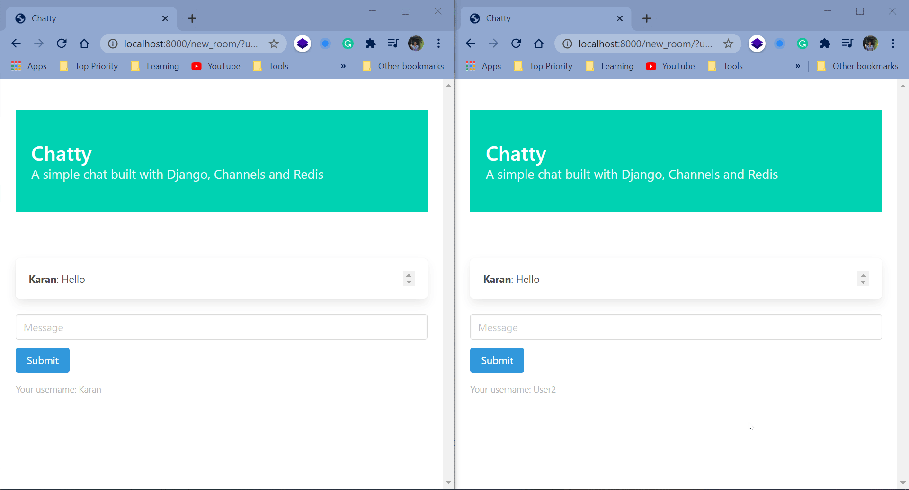

# Chatty - Django Channels Simple Chat

A Simple Chat Application using Django Channels. A User can join a room using room name and their username.

# Install & Run

You will need to install redis to use this application. On windows, I would recommend using WSL for starting redis server. I found this workaround useful instead of using docker.

while running the project you will need to start the redis server in the WSL shell. since the project settings are set for local so you won't need to change any settings.

clone the repo and execute these commands.

```
$ pip install -r requirements.py
$ cd src
$ python manage.py runserver
```

Now you can go to http://localhost:8000 to start using the application.

# Some Screenshots and GIFs


Landing Page

<hr>


Logging inside a room

<hr>


Chatting with another person

# Author

Karan Mittal
